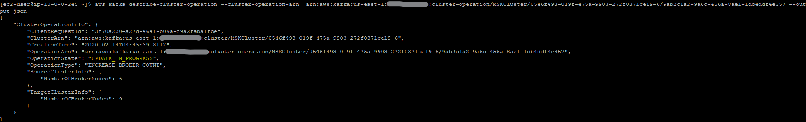

# Adding brokers to MSK using the CLI

You can expand your MSK cluster using the CLI if you prefer to not uset he Console.  Just a couple quick steps!

1. [Get your clusters ARN](/modules/commontasks/getclusterarn.md)

1. Get the configuration hash for the cluster you want to modify, using the ARN from step 1

`aws kafka describe-cluster --cluster-arn $clusterarn --output json | jq ".ClusterInfo.CurrentVersion"`

This will return a string similar to `K138L1TOL8PIJT`

3. Get the current number of brokers

`aws kafka describe-cluster --cluster-arn $clusterarn --output json | jq ".ClusterInfo.NumberOfBrokerNodes"`

This will return the current number of brokers in the cluster

4. Set the new desired number of brokers.  The number must be a multiple of your deployed subnets - ie: if you deploy in 3 subnets, you can only add in 3s.  2 subnets, add in 2s.

`$ aws kafka update-broker-count --cluster-arn $CLUSTERARN --current-version K138L1TOL8PIJT --target-number-of-broker-nodes 9`

After you run the command, it will return your cluster ARN, and a new value, a **ClusterOperationARN**.  This is a value that is unique to this task (cluster expansion), and can be used to query for status.

`ClusterOperationArn:  arn:aws:kafka:us-east-1:xyz:cluster-operation/MSKCluster/0546f493-019f-475a-9903-272f0371ce19-6/9ab2c1a2-9a6c-456a-8ae1-1db4ddf4e357`

5. Check to see how the expansion is progressing

Using the **ClusterOperationARN**, we can check and see the status of the change

`]$ aws kafka describe-cluster-operation --cluster-operation-arn  arn:aws:kafka:us-east-1:155316955788:cluster-operation/MSKCluster/0546f493-019f-475a-9903-272f0371ce19-6/9ab2c1a2-9a6c-456a-8ae1-1db4ddf4e357 --output json`

If `OperationState` has the value of `UPDATE_IN_PROGRESS` wait a while, then run the command again.  When it is complete, the status will be `UPDATE_COMPLETE` and the new brokers are ready for [partitions to be assigned](/modules/addingbrokers/reassignpartitions.md).

**Note**

If you try and set the number of brokers to a number outside the bounds (explained above), you will see the following error:

`An error occurred (BadRequestException) when calling the UpdateBrokerCount operation: The number of broker nodes must be a multiple of Availability Zones in the Client Subnets parameter.`

## References

* [Expanding an Amazon MSK Cluster](https://docs.aws.amazon.com/msk/latest/developerguide/msk-update-broker-count.html)
