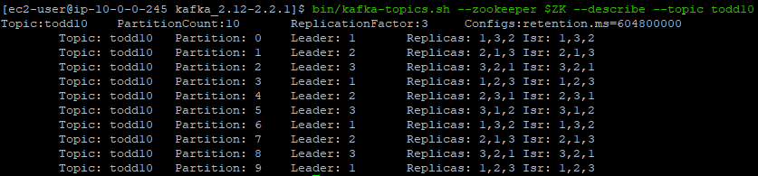
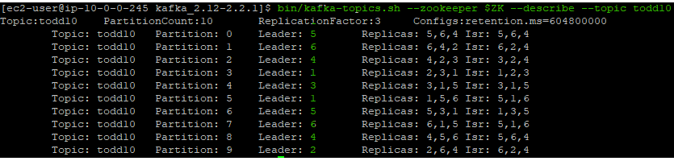
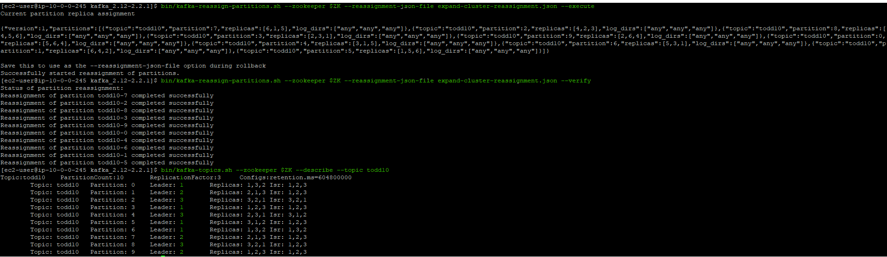

# Reassign Partitions on an MSK Cluster

Your MSK cluster has grown, you've added new brokers.  But, new brokers will just sit there idle until you assign them some work.  This lab will show you how to accomplish this.  

You will need a text editor to keep notes.  For this section you will need:

* [Your Zookeeper connection string](/modules/commontasks/getzkinfo.md)
* To have completed an expansion of your MSK cluster using the [console](/modules/addingbrokers/console.md) or [cli](/modules/addingbrokers/cli.md)

## What are we doing?

Each broker is assigned a number of partitions - a partition is assigned to a broker at the creation time of the topic (which includes partition creation) and/or addition of partitions to a cluster.

We are going to use a [native kafka tool](https://cwiki.apache.org/confluence/display/KAFKA/Replication+tools#Replicationtools-4.ReassignPartitionsTool) to do this assignment.  The basic steps are:

* Generate a list of topics that you want to move 
  * This may be a subset of topics (topic1, topic2), or all your topics (if you want to rebalance the whole cluster)
  * Rebalancing a whole cluster may take a long time and will generate a lot of load on the cluster as data moves around - only do this if you know you need/want to

* Use `kafka-reassign-partitions` tool to generate a reassignment template

* If the reassignment plan looks good, we will execuate the template and start the reassignment
  * We can also edit the template to our liking to tweak the generated suggestions

* Finally, we can monitor the status of the reassignment as we wait for it to complete

## Reassign Partitions

### Preparation

We need to build a list of topics we want to move, and get an understanding of where things are now so we can compare when we are done.  Lets use the topic you created in the Overview section (should be called test10):

1. Get the current partition allocation

`bin/kafka-topics.sh --zookeeper $ZK --describe --topic test10`

Notice that the leaders are all brokers with the IDs of 1, 2, or 3.

2. Create our list of topics to move

Now we will decide what topics we want to migrate, then create a file to describe the topics to move - call this **topics-to-move.json**.  For this example, we will use the topic *test10* from above.  You could also use a topic like **__consumer_offsets** if you want more than one to migrate.

So for **test10**, your `topics-to-move.json` file would look like:

`{ "topics": [ { "topic" : "test10"}], "version":1}`

3. Build a new partition configuration

We know how things look, we know what we want to move, now we need to generate a *candidate assignment*, or a new proposed layout for the partitions.  We will use a tool that comes with Kafka - `kafka-reassign-partitions.sh` in **--generate** mode, along with our Zookeeper connection string and our `topics-to-move.json` file.  You will also need to pass in the list of brokers you want to spead the partitions across - ie: "1,2,3,4,5,6" if you've expanded your cluster to 6 brokers

`bin/kafka-reassign-partitions.sh --zookeeper $ZK --topics-to-move-json-file topics-to-move.json --broker-list "1,2,3,4,5,6" --generate`

The output will be a big long and kinda ugly pair on JSON objects - what you have now, and what the tool is proposing for the end state.  Having the current state is handy if you need to roll back, so copy and paste that somewhere for safekeeping.  As well, copy and paste the new assignments to a file - `expand-cluster-reassignment.json`

*Tip*: If you want to see your file in a more readable way, use jq:

`cat expand-cluster-reassignment.json | jq "."` 

This will give you nicely formatted text.

That's the end of the prep step - now we're on to implementation

### Reassignment time

Time to pull the trigger and make the change on the cluster!

1. Execute the change

For this you will use `kafka-reassign-partitions.sh` again, this we input the `expand-cluster-reassignment.json` file, and tell it to `--execute`

`bin/kafka-reassign-partitions.sh --zookeeper $ZK --reassignment-json-file expand-cluster-reassignment.json --execute`

Once you've run this, and if everything goes as planned, it will return **Successfully started reassignment of partitions.** 

2. Monitor the progress

We can reuse the command above, changing `--execute` to `--verify` to see how the assignements are going

`bin/kafka-reassign-partitions.sh --zookeeper $ZK --reassignment-json-file expand-cluster-reassignment.json --verify`

    Reassignment of partition test10-7 completed successfully
    Reassignment of partition test10-2 completed successfully
    Reassignment of partition test10-8 completed successfully
    Reassignment of partition test10-3 completed successfully
    Reassignment of partition test10-9 completed successfully
    Reassignment of partition test10-0 completed successfully
    Reassignment of partition test10-4 completed successfully
    Reassignment of partition test10-6 completed successfully
    Reassignment of partition test10-1 completed successfully
    Reassignment of partition test10-5 completed successfully

You are done!  That's it.  You can see the state with `kafka-topics.sh`:

`bin/kafka-topics.sh --zookeeper $ZK --describe --topic todd10`

Notice that now the leaders are all 6 brokers, not just the three we saw in the initial part of this lab

### Rollback

If for some reason you wanted to roll back to the previous configuration, you stashed the original state in a file in step 3 above.  Also, the output of the `--execute` had the original state in it.  We can use that data to reassign the paritions back.  Put the contents in to the file `expand-clsuter-reassignment.json` and then rerun your `--execute` command:

`bin/kafka-reassign-partitions.sh --zookeeper $ZK --reassignment-json-file expand-cluster-reassignment.json --verify`

Example:

## Additional Reading

* [Kafka cluster expansion and partition reassignment](https://kafka.apache.org/documentation/#basic_ops_cluster_expansion)
* [Limit replication bandwidth](https://kafka.apache.org/documentation/#rep-throttle)
