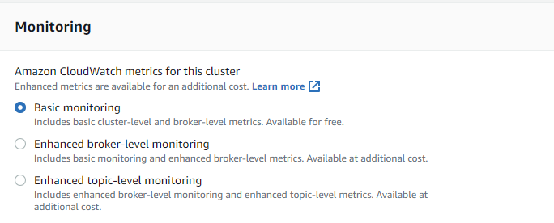

# Cloudwatch Monitoring of MSK

When you create a cluster, you are presented with the choice of what level of detail you want for monitoring - this is related to the metrics that are made available to you via Cloudwatch.  There are a basic set of metrics made available which will let you monitor the cluster/service health, but if you want metrics at a per-broker, or per-topic level, then you need to enable the enhanced metrics.  **Note** that you will incur additional charges by doing anything other than Basic.

See [the MSK Monitoring guide](https://docs.aws.amazon.com/msk/latest/developerguide/monitoring.html#monitoring-level) for more details about specific metrics, but at a high level

  * **Basic/default** metrics will tell you about aggregrate CPU, Memory, Network, and Disk usage, total topics/partitions, offline partitions, and Zookeeper state.  These are the essential metrics to monitor.

  * **Per Broker** metrics is the next additional step, giving you metrics at the broker level, including Bytes In/out, Fetch metrics (related to producers/consumers), Message rate, partition replication information, in depth metrics about producing, Network processing time, etc.  These will help you understand your workloads better, as well as help debug basic problems with your producers/consumers and get a sense for the timing/delays that may show up.  But these are aggregate for the broker.

  * **Per Topic Per Broker** - Here you gain Bytes In/Out, Messages In, Fetch and Produce rates.  These help you understand volume at the topic level, which is essential for some troubleshooting.  But this is also a much higher volume of metrics in to Cloudwatch.

You need to choose the appropriate level of monitoring for your use case, risk tolerance, but you can change the level after the cluster is up so this is a two way door for you.  If you find you don't have enough depth in your metrics, you can turn on more.  If you find you're spending more on cloudwatch than you want to, you can reduce the metric collection level.

Metrics will automatically be gathered and populated in cloudwatch.  Some metrics may not appear until certain events happen in the cluster, such as data being ingested, producers or consumers connecting, etc.  Review the [MSK Monitoring Guide](https://docs.aws.amazon.com/msk/latest/developerguide/monitoring.html#monitoring-level) for more details about what metrics will be available at what stage of the clusters lifecycle.

This exercise will help you look at the basic Cloudwatch Metrics, built a dashboard for MSK, and setup alarms for very important metrics.