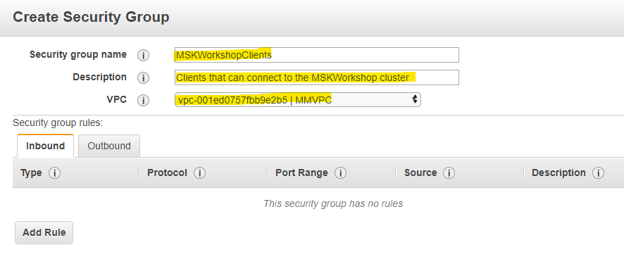
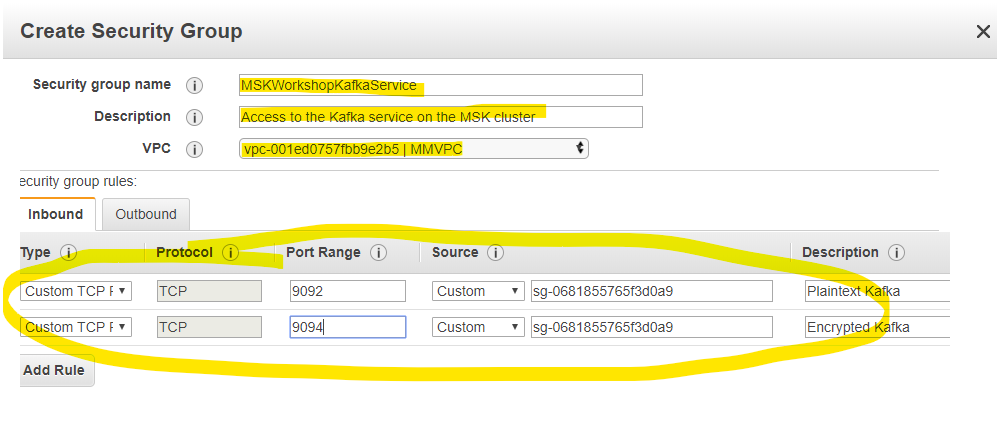

# Lab Preparation

The following steps will prepare you for the creation of the MSK cluster in this lab.

**Note** that running this module will launch AWS resources that have an associated cost.  If you are not running this lab as part of an MSK workshop using provided accounts, remember to clean up when you are done to keep from incurring ongoing charges for resources left running.

---

## OPTIONAL - Step 1- Create a VPC and Subnets

If you want to keep your lab work separate or you're using an existing account and don't want to overlap with others, you can create a VPC and Subnets to work in.  Follow these easy steps to get started:

* [Create a VPC](https://docs.aws.amazon.com/msk/latest/developerguide/create-vpc.html)
* [Add subnets](https://docs.aws.amazon.com/msk/latest/developerguide/add-subnets.html)

You can now proceed with the prep and lab.  Ensure that you use the new VPC when you're completing the lab, it won't be the default so make sure you pick it from the drop downs presented.

---

## Step 2 - Create a custom cluster configuration

Currently it is not possible to create configurations through the Console - you will need the [CLI configured](/modules/commontasks/setupawscli.md) to do this step.

We are going to enable your new MSK cluster to have the following settings:

* **auto.create.topics.enable** - allow topics to be created automatically by producers and consumers.  This is not typically enabled in a production cluster, but it is handy for development and testing to lower the operational overhead
* **delete.topic.enable** - enables topic deletion on the server.  If topic deletion is not enabled, you cannot delete topics.  You likely want to turn this on on all clusters you build unless you have a specific need not to.
* **log.retention.hours** - we will set this to `8` hours for the lab.  Note that this is the default configuration, it can still be [overridden at the topic level](https://docs.aws.amazon.com/msk/latest/developerguide/bestpractices.html)

1. On your Kafka jumpbox, create a file called 'cluster_config.txt' with the following content

        auto.create.topics.enable = true
        delete.topic.enable = true
        log.retention.hours = 8

1. Create the configuration object 

This will push the configuration in to the MSK service for use at cluster creation time

Run the command:

`aws kafka create-configuration --name "WorkshopMSKConfig" --description "Configuration used for MSK workshop - Auto topic creation; topic deletion; 8hrs retention" --kafka-versions "2.3.1" "2.2.1" --server-properties file://cluster_config.txt`

The `--kafka-versions` option is used to tell MSK which versions of MSK this configuration is allowed to be used with.

If you see an error like this: 

    An error occurred (BadRequestException) when calling the CreateConfiguration operation: Unsupported KafkaVersion [2.1.1]. Valid values: [1.1.1, 2.1.0, 2.2.1, 2.3.1]
then ensure that you've typed in the kafka version string correctly (including quotes)

When the command is run, it will return a JSON object, including the ARN for the configuration object.  You should copy and paste this in to your text editor for use later.

Example:

    {
        "Arn": "arn:aws:kafka:us-east-1:xyz:configuration/WorkshopMSKConfig/53481d97-3d6f-4abe-94e4-233ce39e3332-6",
        "CreationTime": "2020-02-15T23:02:11.571Z",
        "LatestRevision": {
            "CreationTime": "2020-02-15T23:02:11.571Z",
            "Description": "Configuration used for MSK workshop - Auto topic creation; topic deletion; 8hrs retention",
            "Revision": 1
        },
        "Name": "WorkshopMSKConfig4"
    }

---

## Step 3 - Review the configuration created

You can review the configuration using the CLI

Using the ARN provided in the output step above (or retrieved from `aws kafka list-configurations`) you can query for your saved configuration

`$ aws kafka describe-configuration --arn arn:aws:kafka:us-east-1:xyz:configuration/WorkshopMSKConfig/2d99aad1-a420-4f62-83c1-0e2473aea998-6`

    {
        "Arn": "arn:aws:kafka:us-east-1:xyz:configuration/WorkshopMSKConfig/2d99aad1-a420-4f62-83c1-0e2473aea998-6",
        "CreationTime": "2020-02-15T22:52:19.563Z",
        "Description": "Configuration used for MSK workshop - Auto topic creation; topic deletion; 8hrs retention",
        "KafkaVersions": [
            "2.3.1",
            "2.2.1"
        ],
        "LatestRevision": {
            "CreationTime": "2020-02-15T22:52:19.563Z",
            "Description": "Configuration used for MSK workshop - Auto topic creation; topic deletion; 8hrs retention",
            "Revision": 1
        },
        "Name": "WorkshopMSKConfig"
    }

For more details on creating and managing MSK Cluster Configuration, see the [MSK Configuration Operations](https://docs.aws.amazon.com/msk/latest/developerguide/msk-configuration-operations.html) document

## Step 3 - Create an MSK security group

By default, the cluster will be attached to the 'default' security group, which allows all ports between all members of the group.  This is fine for testing, but it's not a best practice in production.

We will create two security groups - one to attach to producers, consumers, and admin hosts, and the other to attach to the cluster that references the first.

### Create the client security group

This security group should be attached to any clients who are to access the cluster.  

**Tip**: For this workshop, we will create one group for all access, but you could create a group for each type of access (ie: Encrypted and Plaintext) so you could limit access at the security group level to the services on the cluster.

1. Click on `Services` in the top left corner of the console, and select `EC2`

1. Select `Security Groups` in the left pane

1. Click `Create Security Group`

1. Fill out the form as follows

        Security group name: MSKWorkshopClients
        Description: Clients that can connect to the MSKWorkshop cluster
        VPC: [select the VPC you are using for your lab]

Don't add any rules, and click *Create*

Example:

1. In the security group list, select the `Group ID` for the `MSKWorkshopClients` SG, and copy it to your notepad/texteditor

### Create the access security group for the cluster

This security group will be attached to the MSK cluster and will be used to limit access

1. Click on `Create Security Group`

1. Fill out the form as follows:

        Security group name: MSKWorkshopKafkaService
        Description: Access to the Kafka service on the MSK cluster
        VPC: [select the VPC you are using for your lab]

1. Create rules

    1. Click `Add rule`
    1. Use:
        * Type: Custom TCP
        * Protocol: TCP
        * Port range: 9092
        * Source: [paste the MSKWorkshopClients SG from the previous step]
        * Description: Plaintext Kafka
    1. Click `Add Rule`
    1. Use:
        * Type: Custom TCP
        * Protocol: TCP
        * Port range: 9094
        * Source: [paste the MSKWorkshopClients SG from the previous step]
        * Description: Encrypted Kafka

1. Click `Create`

Example:

In the security group list, select the `Group ID` for the `MSKWorkshopKafkaService` SG, and copy it to your notepad/texteditor

**You are done!**  Now you can move on to the lab. 

---

# Resources

* [Available custom configuration options](https://docs.aws.amazon.com/msk/latest/developerguide/msk-configuration-properties.html)
* [Default MSK configuration](https://docs.aws.amazon.com/msk/latest/developerguide/msk-default-configuration.html)
* [Amazon MSK Operations](https://docs.aws.amazon.com/msk/latest/developerguide/msk-configuration-operations.html)
* [API CLI Reference for create-configuration](https://docs.aws.amazon.com/cli/latest/reference/kafka/create-configuration.html)