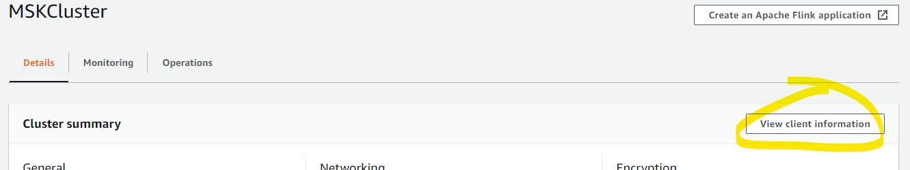
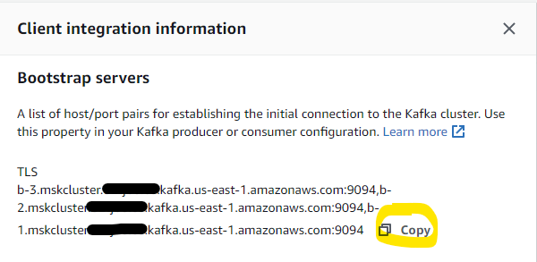

# Get your MSK Zookeeper Connection String

There will be times when you need your broker connection string such as connecting producers and consumers as well as some utilies.  This may be called your `broker list`, `seedbroker list`, or `bootstrap servers` depending on the tool or application you're using.

## Using the AWS Console

1. Open the MSK console at https://console.aws.amazon.com/msk/

1. Click on the name of the cluster you want the details for

3. Click on **View client information** in the **Cluster summary** section

4. Click the **copy** button in the **Bootstrap servers** section

**Note**:

If you are running an MSK cluster with TLS and Plaintext enabled, you will see two sets of server lists.  Ensure you use the correct list for your use case.

Notice that there are two different ports on the same broker - `9092` is the PLAINTEXT port, and `9094` is the TLS port.

**Tip**

If you're working on the command line, and to save yourself some work, put your broker connection string into an envrionment variable:

`$ export BROKER_CONNECT="broker1:9092,broker2:9092,broker3:9092"`

Then you can refer to the variable in later commands:

`$ bin/kafka-console-consuer.sh --bootstrap-server $BROKER_CONNECT --topic test`
