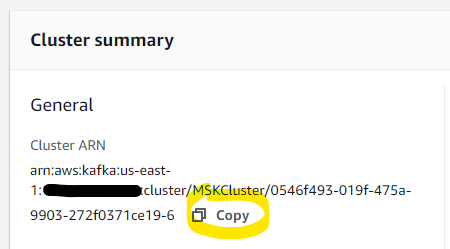

# Get your MSK Cluster ARN

There will be times when you need your Cluster ARN for running commands using the Command Line Interface (CLI).  This will show you where to find this information.

## Using the AWS Console

1. Open the MSK console at https://console.aws.amazon.com/msk/

1. Click on the name of the cluster you want the details for

3. The Cluster ARN will be in the **Cluster summary** section 

You can click on Copy to copy it to your clipboard for use.

## Using the CLI

You can use the AWS CLI to get the same details as the Console.  

1. Ensure that you have [setup the AWS CLI](/modules/commontasks/setupawscli.md)

1. Run the following command to get the ARNs for all the clusters in your default region (this should include the one built for the lab, plus any others you may have built)

`$ aws kafka list-clusters --output text | grep arn | grep CLUSTERINFOLIST
CLUSTERINFOLIST arn:aws:kafka:us-east-1:xyz:cluster/MSKCluster/0546f493-019f-475a-9903-272f0371ce19-6  MSKCluster      2020-01-30T03:58:50.994Z        K138L1TOL8PIJT  PER_TOPIC_PER_BROKER  6ACTIVE  z-3.mskcluster.xyz.c6.kafka.us-east-1.amazonaws.com:2181,z-1.mskcluster.xyz.c6.kafka.us-east-1.amazonaws.com:2181,z-2.mskcluster.xyz.c6.kafka.us-east-1.amazonaws.com:2181`

Your **clusterARN** is the string `arn:aws:kafka:us-east-1:xyz:cluster/MSKCluster/0546f493-019f-475a-9903-272f0371ce19-6` (but will match your region, accountID, and cluster GUID)