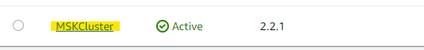

# Get your MSK Zookeeper Connection String

There will be times when you need your Cluster ARN for running commands using the Command Line Interface (CLI).  This will show you where to find this information.

## Using the AWS Console

1. Open the MSK console at https://console.aws.amazon.com/msk/

1. Click on the name of the cluster you want the details for

3. The Cluster ARN will be in the **Cluster summary** section 

You can click on Copy to copy it to your clipboard for use.