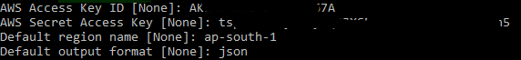

# Setting up AWS CLI

**TODO:** insert intructions on creating an API key for the cluster, or getting it from somewhere based on cloudformation buildout?)
https://docs.aws.amazon.com/cli/latest/userguide/cli-chap-configure.html#cli-quick-configuration

1. Connect to your `KafkaClientInstance` using SSH and the Keypair you provided when the cluster was built

1. Check that the AWS CLI is installed

    $ aws version

    aws-cli/1.x.y Python/3.7.4 Linux/...`

1. Configure the [AWS CLI](https://docs.aws.amazon.com/cli/latest/userguide/cli-chap-configure.html#cli-quick-configuration) with the Access Key ID and Secret Access Key you gathered above

    `$ aws configure`

    for output format you can choose `json`, `text`, `table` - JSON is good for this exercise.  you can change this on the command line by adding `--output [text|json|table` at run time].  this is helpful if you are getting a very large JSON object back and want to see text.
 
4. Test connectivity by running `aws kafka list-clusters` and you should see a list of clusters in your account

