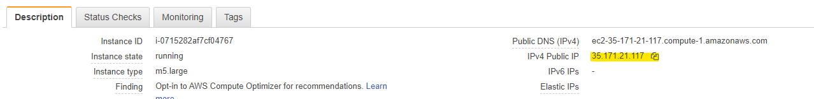

# Installation of Prometheus

1. Login to your Kafka Jumpbox

1. Download tarbar

https://github.com/prometheus/prometheus/releases/download/v2.16.0/prometheus-2.16.0.linux-amd64.tar.gz

1. Untar
tar -zxvf prometheus-2.16.0.linux-amd64.tar.gz

1. Create prometheus server configuration - prometheus.yml

        # file: prometheus.yml
        # my global config
        global:
        scrape_interval:     10s

        # A scrape configuration containing exactly one endpoint to scrape:
        # Here it's Prometheus itself.
        scrape_configs:
        # The job name is added as a label `job=<job_name>` to any timeseries scraped from this config.
        - job_name: 'prometheus'
            static_configs:
            # 9090 is the prometheus server port
            - targets: ['localhost:9090']
        - job_name: 'broker'
            file_sd_configs:
            - files:
            - 'targets.json'

1. Get your [broker list](/modules/commontasks/getbrokerinfo.md) and put it into your notepad

1. Create a file `targets.json`

Contents (replacing `broker_dns_[1,2,N]` with the values from the step above):

    [
    {
        "labels": {
        "job": "jmx"
        },
        "targets": [
        "broker_dns_1:11001",
        "broker_dns_2:11001",
        .
        .
        .
        "broker_dns_N:11001"
        ]
    },
    {
        "labels": {
        "job": "node"
        },
        "targets": [
        "broker_dns_1:11002",
        "broker_dns_2:11002",
        .
        .
        .
        "broker_dns_N:11002"
        ]
    }
    ]

Example of a completed file:

    [
    {
        "labels": {
        "job": "jmx"
        },
        "targets": [
            "b-3.mskworkshopclustercliv.xyz.c6.kafka.us-east-1.amazonaws.com:11001",
            "b-2.mskworkshopclustercliv.xyz.c6.kafka.us-east-1.amazonaws.com:11001",
            "b-1.mskworkshopclustercliv.xyz.c6.kafka.us-east-1.amazonaws.com:11001"
        ]
    },
    {
        "labels": {
        "job": "node"
        },
        "targets": [
            "b-3.mskworkshopclustercliv.xyz.c6.kafka.us-east-1.amazonaws.com:11002",
            "b-2.mskworkshopclustercliv.xyz.c6.kafka.us-east-1.amazonaws.com:11002",
            "b-1.mskworkshopclustercliv.xyz.c6.kafka.us-east-1.amazonaws.com:11002"
        ]
    }
    ]

5. Run prometheus

In the same directly, run `./prometheus`

If everything works as expected, you should see:

`level=info ts=2020-02-17T05:13:05.916Z caller=main.go:630 msg="Server is ready to receive web requests."`

6. Update the security group on your MSK Jumpbox

    * In the Console, open the EC2 service, select `Security Groups`, then `MSKJumpbox`.

    * Click the 'Inbound' tab, then 'Edit' to add a new rule

    * Add a new rule:

        * Type: **Custom TCP**
        * Port Range: **9090**
        * Source: **MyIP**
        * Description: **Prometheus**
        
    * Click Save

7. Connect to Prometheus

* In the Console, switch to the EC2 service, click on your MSK Jumpbox, then copy the IPv4 Public IP address

* Flip to your web browser, browse to the that Public IPv4 address on port 9090

Example: `http://1.2.3.4:9090`
