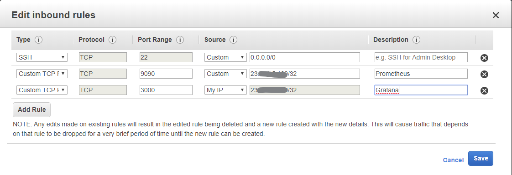

# Installation of using Docker

1. Login to your Kafka Jumpbox as ec2-user

1. Ensure Docker is running

        docker info

    you should see a page of details, not an error/connection failure

1. Create a prometheus directory to work in

        mkdir ~/prometheus

1. Create a servie configuration file

Create prometheus server configuration - `~/prometheus/prometheus.yml` 

        # file: prometheus.yml
        # my global config
        global:
        scrape_interval:     10s

        # A scrape configuration containing exactly one endpoint to scrape:
        # Here it's Prometheus itself.
        scrape_configs:
        # The job name is added as a label `job=<job_name>` to any timeseries scraped from this config.
        - job_name: 'prometheus'
            static_configs:
            # 9090 is the prometheus server port
            - targets: ['localhost:9090']
        - job_name: 'broker'
            file_sd_configs:
            - files:
            - 'targets.json'

1. Get your [broker list](/modules/commontasks/getbrokerinfo.md) and put it into your notepad

1. Create a file `~/prometheus/targets.json`

Contents (replacing `broker_dns_[1,2,N]` with the values from the step above):

    [
    {
        "labels": {
        "job": "jmx"
        },
        "targets": [
        "broker_dns_1:11001",
        "broker_dns_2:11001",
        .
        .
        .
        "broker_dns_N:11001"
        ]
    },
    {
        "labels": {
        "job": "node"
        },
        "targets": [
        "broker_dns_1:11002",
        "broker_dns_2:11002",
        .
        .
        .
        "broker_dns_N:11002"
        ]
    }
    ]

Example of a completed file:

    [
    {
        "labels": {
        "job": "jmx"
        },
        "targets": [
            "b-3.mskworkshopclustercliv.xyz.c6.kafka.us-east-1.amazonaws.com:11001",
            "b-2.mskworkshopclustercliv.xyz.c6.kafka.us-east-1.amazonaws.com:11001",
            "b-1.mskworkshopclustercliv.xyz.c6.kafka.us-east-1.amazonaws.com:11001"
        ]
    },
    {
        "labels": {
        "job": "node"
        },
        "targets": [
            "b-3.mskworkshopclustercliv.xyz.c6.kafka.us-east-1.amazonaws.com:11002",
            "b-2.mskworkshopclustercliv.xyz.c6.kafka.us-east-1.amazonaws.com:11002",
            "b-1.mskworkshopclustercliv.xyz.c6.kafka.us-east-1.amazonaws.com:11002"
        ]
    }
    ]

5. Run prometheus

We are going to fire up Prometheus running docker.  This will pull down the container and run it, mounting the config files created above into the container, and exposing the service on port 9090

`sudo docker run -d -p 9090:9090 --name=prometheus -v ~/prometheus/prometheus.yml:/etc/prometheus/prometheus.yml -v ~/prometheus/targets.json:/etc/prometheus/targets.json prom/prometheus --config.file=/etc/prometheus/prometheus.yml`

The command will return your containerID, eg:

`db5fa73d5a197935cd7294b1db5b3a4d9057afe0ff2624514d28787fb3f778e6`

### Some Docker Tips

If you haven't used docker before, or need a refresh, some basic operational processes:

1. The container will run in the background.  You can view the logs by running

`sudo docker logs <containerID>`

eg:

`sudo docker logs db5fa73d5a197935cd7294b1db5b3a4d9057afe0ff2624514d28787fb3f778e6`

1. If you want to get a shell in the container to look at configs, check processes, etc, you can do:

`sudo docker exec -it <containerID> /bin/sh`

6. Update the security group on your MSK Jumpbox

    * In the Console, open the EC2 service, select `Security Groups`, then `MSKJumpbox`.

    * Click the 'Inbound' tab, then 'Edit' to add a new rule

    * Add a new rule:

        * Type: **Custom TCP**
        * Port Range: **9090**
        * Source: **MyIP**
        * Description: **Prometheus**

    * Add a new rule:

        * Type: **Custom TCP**
        * Port Range: **3000**
        * Source: **MyIP**
        * Description: **Grafana**
        
    * Click Save

7. Connect to Prometheus

* In the Console, switch to the EC2 service, click on your MSK Jumpbox, then copy the IPv4 Public IP address

* Flip to your web browser, browse to the that Public IPv4 address on port 9090

Example: `http://1.2.3.4:9090`

You will now be in the Prometheus web interface

8. Review incoming metrics

You can do some basic graphing and metrics collection in the Prometheus webUI.  But we will use Grafana for more advanced dashboarding

1. In the `Graph` pane in Prometheus (selected from the menu along the top), in the `Expression` bar, start typing `kafka`.  This will allow you to browse all the metrics being pull in to Prometheus

Select [FIGURe OUT SOME USEFUL METRIC ONCE THERE IS DATA IN A CLUSTER]

Click 'Graph' tab under the `Expression` bar and review a simple graph of the metric

# Resources

* [Install Prometheus](https://prometheus.io/docs/prometheus/latest/installation/)