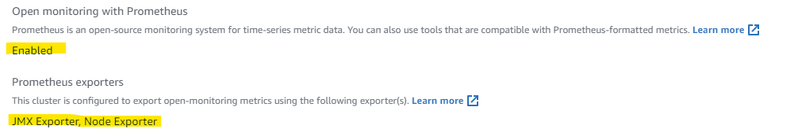
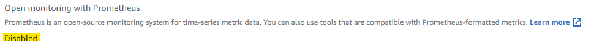
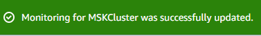

# Open Monitoring Preparation

In order to use Open Monitoring with Prometheus, you need to have completed the steps in this preparation guide.

## OPTIONAL - Enable Open Monitoring

The critical step to using Open Monitoring is that you need to enable it.  It's not enabled by default on all clusters, so if you didn't enable it when you created your cluster, you'll have to turn it on.

Any clusters created as part of this workshop will have Open Monitoring enabled, but if you're using this against an existing cluster, this section will help ensure you're ready.

1. Sign in to the account where the MSK cluster is you want to monitor

1. Open the [MSK Cluster Console](https://console.aws.amazon.com/msk/home?region=us-east-1#/clusters)

1. Click on the MSK cluster you want to enable monitoring on

4. Scroll to the **Monitoring** section

1. If you have already enabled Open Monitoring, you will see a screen similar to this - you can **continue to the next preparation step** if so:

6. If you haven't enabled Open Monitoring, you will see a screen similar to this:

7. Enable Open Monitoring

Since it's not enabled, lets turn it on!

* Click on the 'Edit' button to the right of the **Monitoring** header
* Select the `Enable open monitoring with Prometheus` checkbox
* Select the `JMX Exporter` and the `Node Exporter` checkboxes
* Click `Save Changes`

This will trigger a configuration update on the cluster hat will take a couple minutes to apply.  You will see a blue bar indicated the operation is in progress.  When it is complete, the bar will turn green to indicate the operation is complete.

You are set!  Now you can move on to Step 2 and make the monitoring ports accessible.

---

## Step 2 - Create Security group rules to allow access to monitoring

1. Create a new SG called `MSK_Monitoring` with no rules

* Steps

2. Modify the `MSK Workshop Service` SG to include 2 new rules

* Steps 

    * Type: Custom TCP
    * Port range: 11001-11002
    * Source: MSK_Monitoring security group
    * Description: Prometheus monitoring

3. Attach the MSK_Monitoring SG to your `MSK Jumpbox` instance

* Steps

This will be used shortly