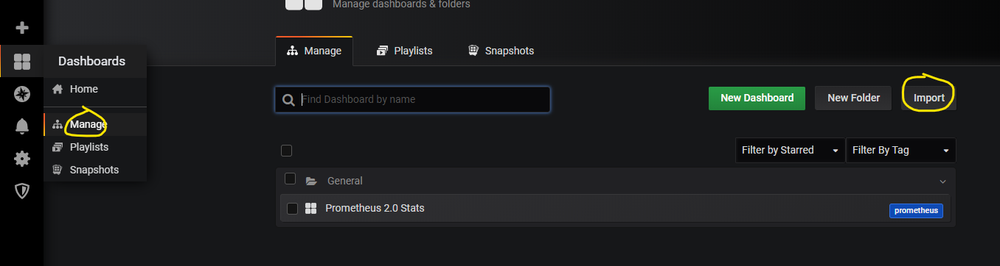
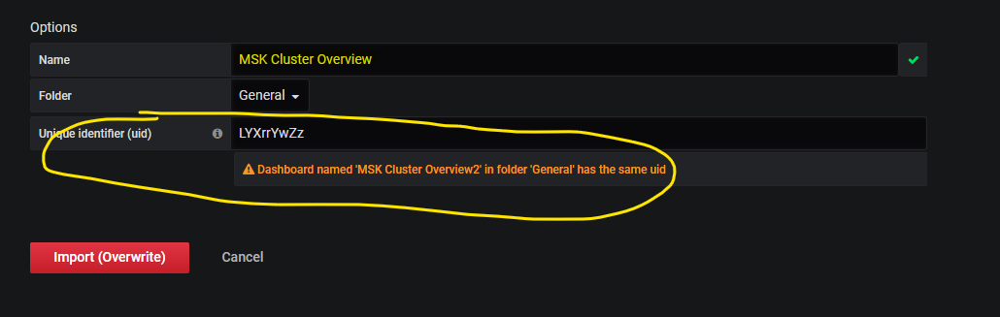
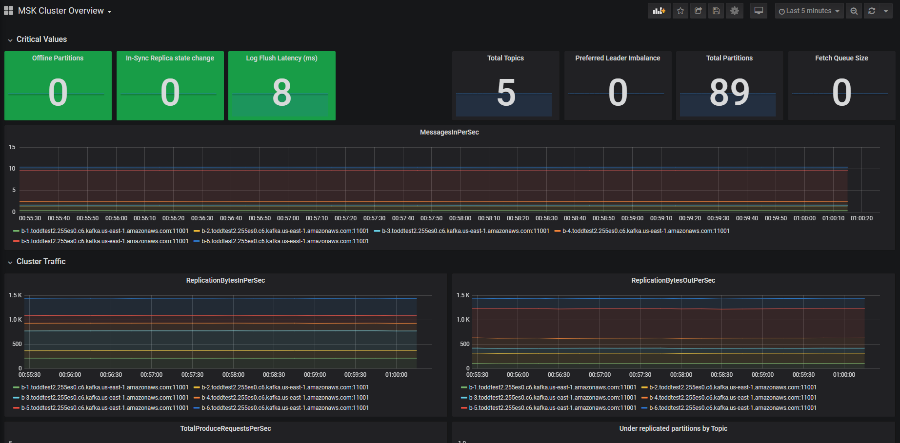

# Running Grafana

We are going to use Grafana as a tool to visualize and Dashboard KSK cluster and topic metrics that are being collected by Prometheus.  Prometheus offers a nice ui for reviewing single metrics, but if you're going to run MSK in production, you'll want nice dashboards.

We will be using Docker to run Grafana on your Kafka Jumpbox - this should keep things nice and simple!

1. Connect to your Kafka Jumpbox as ec2-user

1. Start Grafana in docker:

`docker run -d -p 3000:3000 --name=grafana -e "GF_INSTALL_PLUGINS=grafana-clock-panel" grafana/grafana`

1. Connect to your Kafka Jumpboxes public IP Address on port 3000.  You can get this IP by going to the EC2 console, clicking on your instance labelled `Kafka Jumpbox` and copying the 'public IP'.  An example would be `https://1.2.3.4:3000`.  You should see a Grafana login screen

1. Login with username "admin", password "admin"

1. Feel free to change the password to whatever you feel like when prompted to change it, or hit `Skip`

We now need to add a Data Source to pull in in Time Series data from Prometheus

1. Click on `Add Data Source`

1. Hover over `Prometheus` then click the `Select` button

1. Fill out the configuration:

**Note**: You are going to need the public IP for your Kafka Jumpbox for this

        URL: *http://[jumpox public IP]:9000*
        Access: Server (default)

Click **Save and Test** - the results should come back Green - `Data Source is working`.  If you get an error, check that your security groups were setup properly in the [Preparation](/modules/openmonitoring/prep.md) step.

1. At the top of the Configuration page, click on 'Dashboards' and select `Import` beside `Prometheus 2.0 Stats` - this will bring in a pre-built dashboard for monitoring the Prometheus service itself

### Import a pre-built Kafka dashboard

1. Download [this file](/downloads/msk_grafana_dashboard.json) to your workstation.  This file describes a simple Grafana dashboard we can use to get an overview of our MSK cluster, based on the metrics pulled in to Prometheus.

1. Go back to the Grafana UI in your browser

1. In the left pane click on the Dashboard icon (4 squares), then `Manage`

1. Click Import

1. Click on "Upload .json file" in the top right of the screen, and select the JSON File you downloaded above (`msk_grafana_dashboard.json`)

**Note** if you get an error about another dashboard having the same UID, type in some random characters in the box above and hit 'Import'

1. You should now see a screen that looks similar to this:

This dashboard is displaying the metrics gathered from your MSK cluster via the Prometheus service.  A quick summary of what the graphs mean:

### Grafana Dashboard Content Review

In the top row we have 8 boxes with individual metrics.  They are:

* Offline Partitions: The number of partitions in your cluster that are not available for read/write.  This number being non-zero is bad.

* In-sync replica state change: This number will be non-zero if there are partitions that are going in/out of sync with the leader.  This is normally indicitive of a problem or cluster changes.

* Log Flush Latency: How many ms it's taking (max value) to write data to disk across the brokers.

* Total Topics: The total number of topics on the cluster

* Preferred Leader Imbalance: The number of partitions that have been flagged as needing to have their leadership moved to another broker (typically to balance performance) but that haven't yet moved.  A high number here may indicate that the process is hung, a broker has failed, or something else odd is going on.

* Total Partitions: The total number of partitions on this cluster

* Fetch Queue Size: The number of outstanding requests to fetch data for replication.  If this gets high it indicates that replication is falling behind.

We then have some basic Cluster stats:

* MessagesInPerSec: Total number of messages being written to your MSK cluster - this is a rolling 1minute rate

* Replication Bytes In Per Sec: how many bytes each broker is replicating in.

* Replication Bytes Out Per Sec: How many bytes each broker is replicating out.

* Total Produce Requests Per Sec:  How many requests are being made to produce data to the cluster.

* Under Replicated Partitions: Every partition will have a desired replica count (typically 3) - this will give you a count of partitions that are behind in their replication.

* Zookeeper Disconnects per second: MSK/Kafka rely on Zookeeper for coordinating and sharing Metadata.  If brokers are losing connections to Zookeeper, it indicates a serious problem with the cluster.

Finally, we have some Network data:

* Network Bytes: the amount of data (in bytes) hitting the broker process

* Network Requests per sec: a guage of the number of network requests at the given time

* Network CPU Idle Time: How much time the network processing thread is spending idle.  This being low means the broker is struggling to pull data off the network fast enough, and you may need to consider improving your network IO (by upgrading instance types), or rebalancing the cluster to take some load off the broker.

* Network Errors Per sec: Errors the broker has thrown getting data from the network.  The occasional error isn't an issue, it's when you see a spike/growth in errors while the requests/sec drop that you need to investigate.

## Finding Metrics

There are lots of resources on the Internet that will point out Metrics that are very important to monitor.  But through the life of Kafka metrics have sometimes changed names and their location in the metrics system.

A quick way to look for metrics, if you have a sense of the name you're looking for, is to pull data from the metrics endpoint on your kafka cluster and search.  This can be done easily with `curl` and `grep`.  You are going to hit the /metrics endpoint of the JMX Prometheus endpoint, which runs on port 11001.

        $ curl b-1.xyz.34234d.c6.kafka.us-east-1.amazonaws.com:11001/metrics | grep ZooKeeperDisconnectsPerSec
        
        kafka_server_SessionExpireListener_MeanRate{name="ZooKeeperDisconnectsPerSec",} 0.0

in the returned results, you can see that the metric is `kafka_server_SessionExpireListener_MeanRate`, with a label of `name=ZooKeeperDisconectsPerSec`.  You can then use this in Grafana to construct a query like `kafka_server_SessionExpireListener_OneMinuteRate{name="ZooKeeperDisconnectsPerSec"}` and graph the value over the members of the cluster.

# Keep Playing

There are lots of resources on the Internet to help you learn how to use Prometheus and Grafana - this was just an introduction.  Explore the metrics in Prometheus.  Click on the graphs and **e**dit them, so you can see how Grafana works.  Try copying a graph and changing the metric it's displaying.  Try changing the colours of the lines, changing to bar graphs, addign data points, adding a legend.  

When you are done, you can simply stop the docker container (`docker kill grafana`) and the container will go away and any unsaved work will be gone.

If you want to save your work, you can export the JSON for your dashboard by clickong on the gear at the top, then click `JSON model` on the left, and now you can copy the JSON that defines the dashboard and save it for later. 

# Resources

* [Introduction to PromQL](https://grafana.com/blog/2020/02/04/introduction-to-promql-the-prometheus-query-language/) - Learn more about building queries against Prometheus in Grafana